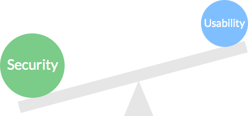
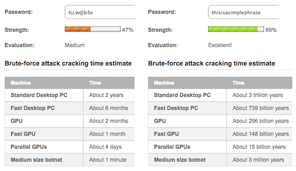
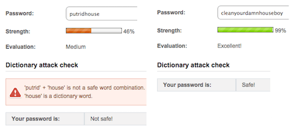
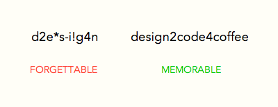
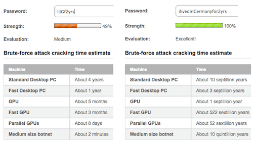
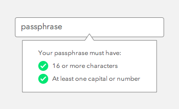

A user’s account on a website is like a house. The password is the key, and logging in is like walking through the front door. When a user can’t remember their password, it’s like losing their keys. When a user’s account is hacked, it’s like their house is getting broken into.

Nearly half of Americans (47%) have had their account hacked in the last year alone. Are web designers and developers taking enough measures to prevent these problems? Or do we need to rethink passwords?

#####COMPROMISING SECURITY

On most websites, you need to create an account to do more than browse. Users will create many passwords in their lifetime. But remembering them all is no easy task. They could use the same password for every account, but that makes them more vulnerable to attack if one gets compromised. They could use passwords that are easy to remember, but an easy password is an easy target for brute-force hacking.

They could jot down or store all of their passwords in case they forget, but if someone gets ahold of that paper or file, then all of their accounts will be compromised. As well, it’s easy to misplace papers and files and inconvenient to pull them out every time you want to log in somewhere.

No matter what they do, when users create a password with usability in mind, they often end up compromising security.

#####COMPROMISING USABILITY 

To keep their accounts secure, users could create passwords that meet the maximum requirements of a “strong” password. Such a password would include:

* numbers,
* lowercase letters,
* capital letters,
* punctuation symbols,
* and a certain number of characters.

And it should not include:

* a dictionary word,
* a common password,
* or words found in your name, username or company name.

Coming up with a password that meets these requirements would take most users a long time. You risk losing registrations if they take longer than expected. When a user finally comes up with a password, it’s often so random that it’s almost impossible to remember. This increases the chance that the user will forget and be unable to log in. Also frustrating is when a user is locked out of their account after trying too many passwords.

Typing passwords isn’t easy either, much less remembering them. Users are prone to error when they have to hold the Shift key to type capital letters or symbols. A password that’s secure but not usable won’t do users any good.

#####Passphrases: A Change For The Better 

Balancing security and usability is a must, but passwords today don’t cut it. Websites need to change for the better and need to upgrade from passwords to passphrases.
Passwords and passphrases serve the same purpose. But passwords are generally short, hard to remember and easier to crack. Passphrases are easier to remember and to type, and they’re considered more secure due to their length and because you don’t need to write them down.

#####Why Passphrases Are More Secure 

LONGER REQUIREMENT STOPS BRUTE-FORCE ATTACKS 

Most passwords have a minimum requirement of 8 characters. But most passphrases have a minimum requirement of 16 characters. This greater length provides more security because it takes far longer to crack.

Increasing character length increases the total number of possible correct passwords. The longer a password is, the longer a brute-force program will take to guess the right one. Let’s put this to the test by comparing a complex password with a simple passphrase using a sophisticated password checker.

The complex password will not have any dictionary words and will contain numbers, capital letters and symbols, making it as strong as can be. The simple passphrase will contain dictionary words and only lowercase letters, making it as weak as can be.

When comparing the two, we can see that the simple weak passphrase is impossible to brute-force hack. But the strong, complex password would take less than two years to hack. You would expect the password to take longer than that because of its high character complexity. That goes to show that character length is what protects users from brute-force attacks, not character complexity.

#####MULTIPLE WORDS STOP DICTIONARY ATTACKS 

Brute force isn’t the only way to hack a password. Hackers can also use dictionary attacks. But a passphrase will protect users against dictionary attacks more than a password. Although using a password that contains only dictionary words is not recommended, it is still common and can get hacked easily. But if users were to use only dictionary words in a passphrase, they would stay safe from this type of attack.

Most dictionary passwords contain one or two words. A dictionary attack is more likely to succeed here because of the limited number of words in the dictionary. Even an uncommon dictionary word wouldn’t stop a dictionary attack. A dictionary passphrase would contain at least five words. The virtually infinite number of word combinations makes it impossible for a dictionary attack to succeed.

#####MULTIPLE PARTS OF SPEECH MAKE IT HARDER TO GUESS 

Passwords that are easy to guess often contain a single piece of personal information: the user’s name, birthdate or pet, their favorite color, food or place, etc. All of these nouns easily meet the character-length requirement for a password.

The longer character-length requirement of a passphrase prevents users from using personal information. A single noun isn’t enough to meet the requirement. This forces users to add other parts of speech to their passphrase, making it harder to guess.

#####Why Passphrases Are More Usable 

PHRASES ARE EASIER TO REMEMBER THAN RANDOM CHARACTERS 

It’s easier to recall a phrase than random characters. Phrases are meaningful and relatable. This is why users are able to remember a passphrase more than a password. When users create a password, they have to meet the form’s password policy. Many forms do not allow dictionary words to keep users safe from dictionary attacks. Users have no choice but to add randomness to their password.

But a random non-dictionary word is the hardest for users to remember. Many will opt to use a word and add random characters within it. But that’s still hard to remember because the random characters could go in many places.

Adding complexity to a passphrase is easier because you can add elements between words. This makes the randomness easier to remember because there are fewer places between words. A passphrase doesn’t need the high level of randomness of passwords. A little complexity goes a long way because of the security that a passphrase brings. Some people use the first letter of each word in a sentence as their password. This is much more memorable but still not as secure as a passphrase.

For example, the sentence “I lived in Germany for two years” could be turned into “iliGf2yrs.” Even with a capital letter, a number and random letters, it’s still vulnerable to brute-force hacking. The same sentence spelled out as the passphrase “ilivedinGermanyfor2yrs” would be unhackable. The difference in character length has a huge impact on security.

#####WORDS ARE ALLOWED 

Finding a password that doesn’t include a dictionary word is the toughest password requirement for users to meet. Carnegie Mellon’s research data show that “creating a password is significantly more difficult under stricter password policies, particularly those involving dictionary checks.”

Coming up with a random non-dictionary word is hard to do and hard to remember. Passphrases don’t need strict dictionary checks. Words are allowed as long as they meet the passphrase’s length requirement. The compromise of usability for security in password policies is too wide a gap to ignore. Passphrase policies balance both, minimizing registration abandonment or user frustration.

#####PASSPHRASE POLICIES ARE LESS STRICT IN REGISTRATION FORMS 

Users often get stuck on registration pages when they can’t create a password that meets the website’s policy. This happens because password policies have too many requirements, creating frustration in users and leading them to abandon forms.

Password Policy:

* has at least 8 characters
* includes capital and lowercase letters
* includes one or more digits
* includes one or more symbols (@, #, $, etc.)
* prohibits words found in dictionary
* prohibits user’s personal information

Passphrase Policy:

* has at least 16 characters
* includes a capital letter or number

Passphrase policies don’t need to be as strict to give users security. The only requirement a passphrase needs is to be 16 character or longer. The researchers found that “a 16-character minimum with no additional requirements provides the most entropy while proving more usable on many measures than the strongest alternative.” This helps users to create accounts more easily while maintaining security.

Password policies vary between websites. This forces users to create a different password to meet each website’s requirements. Users end up with a long list of different passwords to manage. Passphrase policies wouldn’t vary between websites, though. All that is needed for maximum security is a length of 16 or more characters and a capital letter or number.

#####What Websites Should Do 

REPLACE “WORD” WITH “PHRASE” 

The first step is to take the “word” out of password. The term “password” gives users the impression that the website expects them to use a word. But a word isn’t secure under any circumstances.

Change the user’s understanding by using the term “passphrase” instead. This tells them that you expect a phrase, not a word. By making this expectation clearer, users will know that a phrase is more secure than a word.

#####MAKE THE POLICY CLEAR 

Most users are accustomed to seeing password policies. Let them know that a passphrase policy is different by displaying the requirements upon registration. Pop up a tooltip over the passphrase text field.

Don’t make users have to count 16 characters when creating a passphrase. Do it for them by designing a tooltip to validate their input. When the user meets the requirement, a green checkmark should appear next to the field.

The good news is that switching to passphrases doesn’t require a technical overhaul. It’s as simple as introducing the concept to users and requiring a higher character length.

The state of passwords today causes more headache than happiness. Passphrases are a better alternative because they are more secure and usable. A few websites out there enforce passphrases. More should follow suit in order to decrease account breaches and user frustration. No user should feel like they’ve lost their keys or had their house broken into.